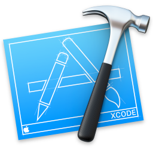

**CSCI 5828: Foundations of Software Engineering**  
*Fall 2015, Professor Kenneth Anderson*

Student: **Matthew Thomas**  
Presentation 2  

  
# Xcode

Xcode is the [Integrated Development Environment (IDE)](https://en.wikipedia.org/wiki/Integrated_development_environment) for developing software for projects on Mac OS X, iOS, watchOS and tvOS.

## Background  
Xcode is available only for Mac OSX and is free to download from the [Mac App Store](http://www.apple.com/osx/apps/app-store/). Preview and previous versions of Xcode are available via the [Apple Developer Portal](https://developer.apple.com).

The first version of Xcode was released in 2003, and was based off of Project Builder (PBX) which had previously been used to build software for OS X. Starting with Xcode 4 in 2010, Apple has announced a new version of the software annually at the [Apple Worldwide Developers Conference (WWDC)](https://developer.apple.com/wwdc/).  

During the transition phase from one version of Xcode to the next, it is common to keep both the previous version and the new version until all projects are updated. This can be done by simply giving the two versions of the Xcode app different names, and selecting the version of command-line tools to use via [xcode-select](https://developer.apple.com/library/mac/documentation/Darwin/Reference/ManPages/man1/xcode-select.1.html).  

The most popular alternative IDE for developing native software for OS X, iOS, and watchOS is [AppCode](https://www.jetbrains.com/objc/). Other IDE's support cross-platform development of OS X and iOS apps using langauges like C#.  

Xcode is complex software with many features. This presentation will cover some of the more popular and used workflows and features.  

## Design and Develop  
Xcode is made of many panels, areas and modes. These sections will go over the features that help a developer during the design and implementation phase of the software life cycle.  
* [Navigators](develop-navigators.md)  
* [Source Editor](source-editor.md)  
* [Editor Panes](editors.md)  
* [Documentation](documentation.md)  
* [Interface Builder](interface-builder.md)  

## Build, Debug, and Deploy  
Software Engineer is not just programming, but includes a whole range of logistical components including build configurations, debugging and distribution. These pages review useful workflows that help with the processes beyond writing code.  
* [Build Configurations](build-configurations.md)  
* [Schemes](schemes.md)  
* [Debug Area](area-debug.md)  
* [Distribution](distribute.md)  

Xcode is a powerful Integrated Development Environment that enables mobile developers to create beautiful, safe and intuitive apps. If you'd like to learn more about Xcode, here is some [further-reading](further-reading.md).  

###References  
[1] https://en.wikipedia.org/wiki/Xcode  

Written by [Matthew Thomas](mailto:matt@bocosoft.net)  
*Fall 2015, CSCI 5828*
