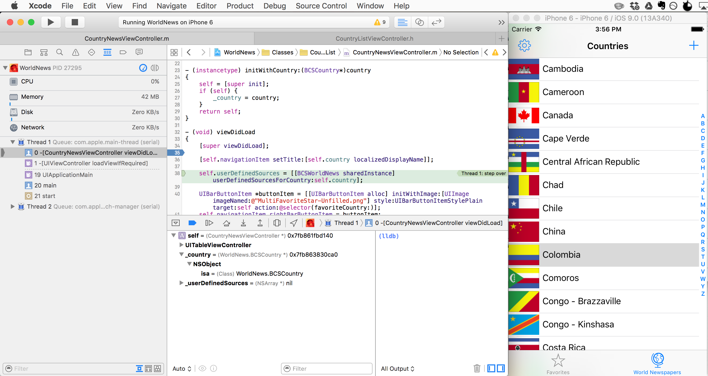
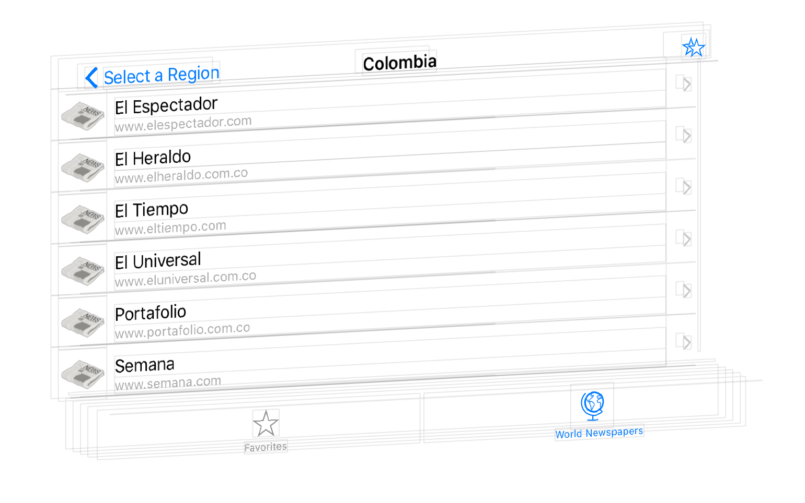

#Window Area: Debug  

When the code is ready to build and run, click the "Play" button in the top left corner of Xcode, making sure that the correct scheme and deployment platform is selected to the right of the "Play" button. This presentation will use the simulator for demonstration purposes.  

When the source code succesfully compiles, Xcode will display the simulator for the selected platform (e.g. iPhone 6) and the debug area will be automatically displayed from the bottom of the Xcode window.  

 

At any point during execution, clicking the "Stop" button next to the "Play" button will halt execution and quit the app.  

The debug area consists of a toolbar at the top, and two view panels that make up the rest of the debug area. These view panels can be shown and hidden using the two furthest-right buttons on the bottom right of the debug area.  

###Toolbar  
The toolbar consists of the following buttons in order:  
1. Show/Hide Debug area visibility  
2. Enable/Disable Breakpoints  
3. Pause/Continue program execution  
4. Step over  
  * Execute current line of code and continue execution to the next line of code in the same file.  
5. Step in  
  * Execute current line of code. If the current line of code is a subroutine, go to the first line of that subroutine.    
6. Step out  
  * Execute the remaining portion of subroutine, and jump back to the next line of the calling routine.
7. Debug View Hierarchy  
  * This is a powerful feature that displays a 3D-rendering of the current view hierarchy.  

  

###Variables View  
When a breakpoint is reached, or execution is paused, the Variables view displays hierarchical detailed debugging information about the variables in context. Right-clicking on any of these variables provide access to more powerful features.  

###Console View  
The Console View is where the text of all NSLog and print statements are printed. It also offers a command-line interface to interact with the current state of the application.  

The trash can icon wipes the contents of the console.  

*References*  
[iOS Developer Library: Debugging with Xcode](https://developer.apple.com/library/ios/documentation/DeveloperTools/Conceptual/debugging_with_xcode/chapters/debugging_tools.html)  
