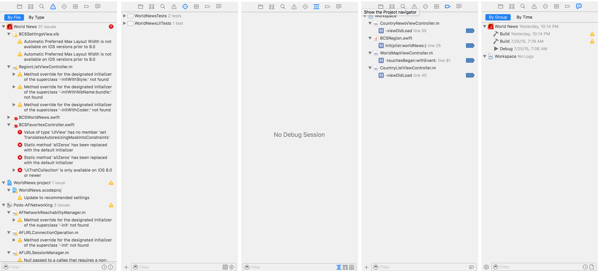

#Navigator Area  

The far left panel is called the Navigator area. At the top of the Navigator area is series of tabs that open Navigators which assist at various stages of the software life cycle. Below are the Navigators that are frequently used when writing code.  

Every navigator contains a toolbar and filter at the bottom, and context-sensitive buttons appear depending on the selected navigator.  

  

###Project Navigator  

The first tab is called the Project Navigator, is the default and most commonly used tab during development. The Project Navigator consists of at least one Project, within which is contained groups, folder references, and files.

At the bottom of the Project Navigator is a tool bar which contains:  
* '+' button: To quickly add new or existing files to the project  
* Filter: To filter the hierarchical file list  
* Recent Filter: A quick filter to show only recent files in the hierarchical list  
* SCM Filter: A quick filter to show only files that have a source control status  

#####Version Control Integration  
The file list integrates source control by showing an icon to the right of files which have a version control status: '?' Files that have been added to the repository but not yet staged  
'A' Files that have been added and staged but not yet committed  
'M' Tracked files which have been changed since the last commit  

#####Opening Files  
Xcode supports opening files in multiples tabs. To open a file in the current tab, simply single-click the file. Double-clicking a file can yield different behavior depending on user-preferences configured in Preferences on the "Navigation" tab. Xcode can be configured to open a file in a new tab when the file is double-clicked.  

#####Adding Files  
There are many ways to add new files to the project:  
* Drag and drop a file or folder directly into the file list inside of the desired group level.  
* Use the bottom toolbar '+' button  
* From the Xcode File menu, selecting either "New..." or "Add Files to [Project]..."  
* Right-clicking on any folder reference, group, or file in the Project Navigator and selecting "New File..." or "Add Files to [Project]..."  

#####Removing Files  
It's a good idea to keep the Project Navigator file list clean of unnecessary files. There are also several ways to remove a file or group from the list. First select the file, then...  
* Hit the 'delete' key on the keyboard  
* Right-click on the file and select 'Delete'  
* From the Xcode Edit menu, select "Delete"  

If you attempt to remove a group of file or a single file, a confirmation dialog will appear asking how the file should be removed:  
*Remove Reference*: This means that the file reference(s) will be removed from the project list, but the file(s) will persist on disk.  
*Move to Trash*: This means that both the file reference(s) will be removed from the project list, as well as the file(s) being deleted from disk.  

  

If you attempt to remove an empty group or an invalid file reference, the change will occur immediately without any confirmation dialog.  

*Reference*  
[iOS Developer Library: Project Navigator Help](https://developer.apple.com/library/ios/recipes/xcode_help-structure_navigator/articles/About_the_Project_Navigator.html)  

###Symbol Navigator  

The Symbol Navigator displays a flat or hierarchical list of symbols used in the Project. Just like the Project Navigator, the Symbol Navigator contains of a list and a toolbar at the bottom. The toolbar contains a dynamic text filter as well as three preset filters:  

1. Show only class and protocol symbols (hide other global symbol types)  
*For example, Functions, Structs, Unions, Enums, Types and Globals.*  

2. Show only project-defined symbols  
*I recommend that this filter be used to filter out all lower-level system symbols and concentrate on the symbols that the develop has defined.*  

3. Show only containers (hide members)  

In my own experience, this is an infrequently used navigator and is not an important part of a developer's workflow.  

*Reference*  
[iOS Developer Library: Symbol Navigator Help](https://developer.apple.com/library/ios/recipes/xcode_help-symbol_navigator/Recipe.html)  

###Find Navigator  

This is a more complex navigator with many frequently used features for finding files and symbols across the workspace or a specific scope.

The keyboard Shortcut to access the Find Navigator is Command+Shift+F (⌘⇧F), which is similar to the Find-in-file keyboard shortcut.  

#####Jump Bar
The top jump bar controls the find operations via three levels:  
1. Find or Replace  
  * Find simply finds symbols  
  * Replace finds and replaces symbols with a new symbol  
2. Text, References, Definitions, Regular Expression, Call Hierarchy  
3. Containing, Matching, Starting with, Ending with  
  * These patterns do not apply to Regular Expression or Call Hierarchy.  

####Search Bar  
Below the search bar is a text field to type in the search text, pattern or regular expression. If the Replace operation is active, then a second text field will display.

The magnifying glass dropdown displays a list of recent results.

#####Context  
The find/replace operation can be performed within the entire workspace, or by clicking "In Workspace" the developer can define within which Projects, Folder References, or Groups the search should be performed.  

To the right of the context definition, the search can be toggled between "Igoring Case" and "Matching case".  

  

###Issue Navigator  
The issue navigator displays a hierarchical list of warnings and error related to the most recent build. The list can be sorted by file and by type. Single-clicking any issue will display the issue in code. In many cases, Xcode will offer suggestions for how to correct the issue.  

The toolbar contains several filters which help to narrow down the issue list:  
* Show issues with matching content  
* Show only errors  

[iOS Developer Library: Issue Navigator](https://developer.apple.com/library/ios/recipes/xcode_help-issue_navigator/articles/viewing_issues_in_the_issue_navigator.html)  

###Test Navigator  
The test navigator displays a list of tests and indicators to the right of each test for success or failure. Testing is a powerful and important part of the software life cycle, and deserves a presentation devoted to the topic, so I will not delve further into this topic.  

[iOS Developer Library: Test Navigator](https://developer.apple.com/library/ios/recipes/xcode_help-test_navigator/Recipe.html)  

###Debug Navigator  
The Debug Navigator displays the call stack when the app has been paused, either via the pause button on the Debug area toolbar, or via a prefined breakpoint.  

In addition, the Debug Navigator offers a quick glance at CPU, Memory, Disk, and Network usage without having to use a Profiler.  

[iOS Developer Library: Debug Navigator](https://developer.apple.com/library/ios/recipes/xcode_help-debug_navigator/articles/about_debug_navigator.html)  

###Breakpoint Navigator  
The Breakpoint Navigator displays a hierachical list of breakpoints set throughout the project. Clicking the blue breakpoint icon to the right of each breakpoint will disable or enable the breakpoint. Dark blue means enabled and faded blue means disabled.  

There is a specialized filter on the bottom toolbar that makes the breakpoint navigator display only the enabled breakpoints.  

[iOS Developer Library: Breakpoint Navigator](https://developer.apple.com/library/ios/recipes/xcode_help-breakpoint_navigator/articles/about_breakpoint_navigator.html)  

###Report (Log) Navigator  
This navigator shows historical reports generated during the development process, including build, debug, archive and other events. If Xcode Server is used and connected for Continuous Integration, the build reports will appear in this navigator as well.  

[iOS Developer Library: Log Navigator](https://developer.apple.com/library/ios/recipes/xcode_help-log_navigator/articles/log_navigator-about.html)  
