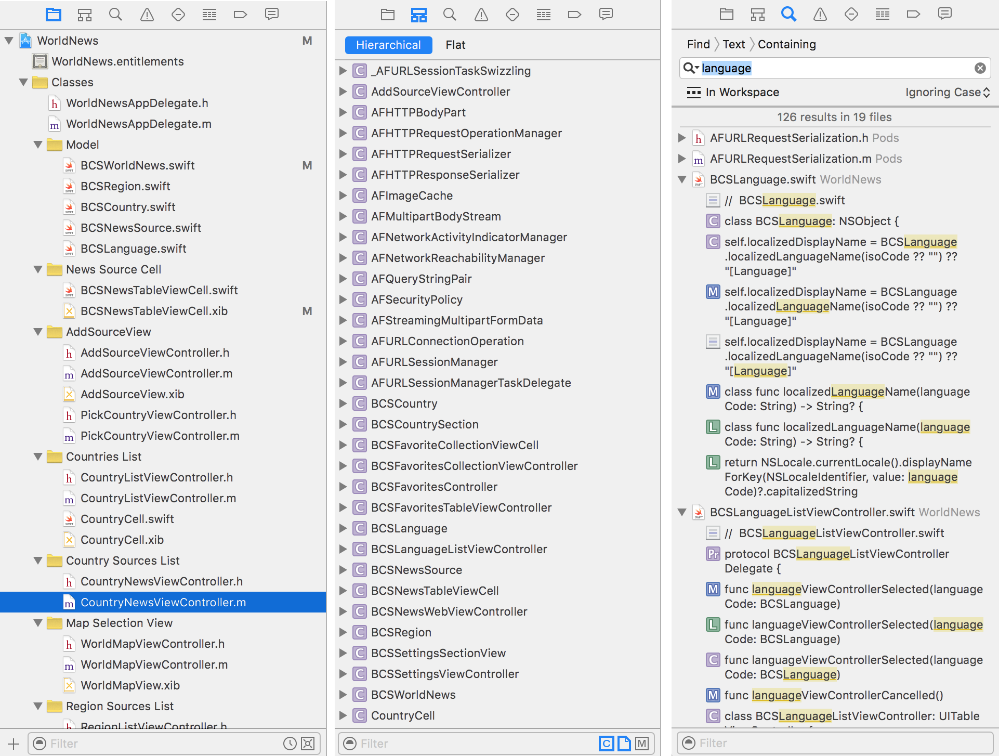
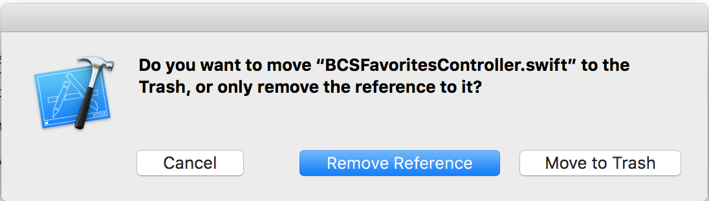

#Navigators: Develop  

The far left panel is called the Navigator area. At the top of the Navigator area is series of tabs that open Navigators which assist at various stages of the software life cycle. Below are the Navigators that are frequently used when writing code.  

  

###Project Navigator  

The first tab is called the Project Navigator, is the default and most commonly used tab during development. The Project Navigator consists of at least one Project, within which is contained groups, folder references, and files.

At the bottom of the Project Navigator is a tool bar which contains:  
* '+' button: To quickly add new or existing files to the project  
* Filter: To filter the hierarchical file list  
* Recent Filter: A quick filter to show only recent files in the hierarchical list  
* SCM Filter: A quick filter to show only files that have a source control status  

#####Version Control Integration  
The file list integrates source control by showing an icon to the right of files which have a version control status: '?' Files that have been added to the repository but not yet staged  
'A' Files that have been added and staged but not yet committed  
'M' Tracked files which have been changed since the last commit  

#####Adding Files  
There are many ways to add new files to the project:  
* Drag and drop a file or folder directly into the file list inside of the desired group level.  
* Use the bottom toolbar '+' button  
* From the Xcode File menu, selecting either "New..." or "Add Files to [Project]..."  
* Right-clicking on any folder reference, group, or file in the Project Navigator and selecting "New File..." or "Add Files to [Project]..."  

#####Removing Files  
It's a good idea to keep the Project Navigator file list clean of unnecessary files. There are also several ways to remove a file or group from the list. First select the file, then...  
* Hit the 'delete' key on the keyboard  
* Right-click on the file and select 'Delete'  
* From the Xcode Edit menu, select "Delete"  

If you attempt to remove a group of file or a single file, a confirmation dialog will appear asking how the file should be removed:  
*Remove Reference*: This means that the file reference(s) will be removed from the project list, but the file(s) will persist on disk.  
*Move to Trash*: This means that both the file reference(s) will be removed from the project list, as well as the file(s) being deleted from disk.  

  

If you attempt to remove an empty group or an invalid file reference, the change will occur immediately without any confirmation dialog.  

*Reference*  
[iOS Developer Library: Project Navigator Help](https://developer.apple.com/library/ios/recipes/xcode_help-structure_navigator/articles/About_the_Project_Navigator.html)  

###Symbol Navigator  

The Symbol Navigator displays a flat or hierarchical list of symbols used in the Project. Just like the Project Navigator, the Symbol Navigator contains of a list and a toolbar at the bottom. The toolbar contains a dynamic text filter as well as three preset filters:  

1. Show only class and protocol symbols (hide other global symbol types)  
*For example, Functions, Structs, Unions, Enums, Types and Globals.*  

2. Show only project-defined symbols  
*I recommend that this filter be used to filter out all lower-level system symbols and concentrate on the symbols that the develop has defined.*  

3. Show only containers (hide members)  

In my own experience, this is an infrequently used navigator and is not an important part of a developer's workflow.  

*Reference*  
[iOS Developer Library: Symbol Navigator Help](https://developer.apple.com/library/ios/recipes/xcode_help-symbol_navigator/Recipe.html)  

###Find Navigator  

This is a more complex navigator with many frequently used features for finding files and symbols across the workspace or a specific scope.
