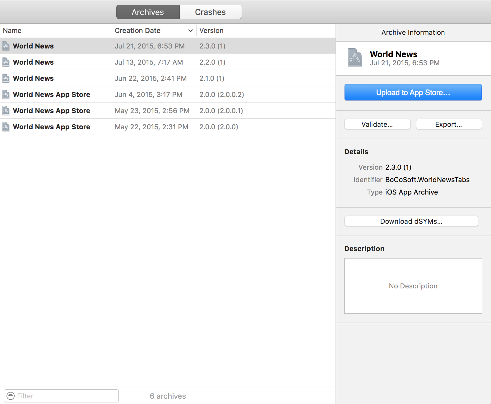

#Distribute  

When a build is ready to be distributed to some audience, it must be archived through Xcode. It is important to build and archive your app through a legitimate version of Xcode that was downloaded from the official Apple Developer's website instead of a mirror, otherwise you could be [introducing security concerns](https://developer.apple.com/news/?id=09222015a).  

The "Archive" operation can be accessed from Xcode's Product menu. When an archive successfully completes, Xcode will automaticall open the Organizer window.  

  

From the Organizer window, builds can be directly uploaded to iTunes Connect using the "Upload to App Store..." button. In reality, Organizer does not submit the build to the App Store, but rather uploads the build to iTunes Connect which is the gateway to the App Store. iTunes Connect also serves as the interface to TestFlight, the beta build distribution platform created by Burstly and acquired by Apple in 2014. TestFlight allows developers to distribute builds both to internal and external beta testers, however external beta testing requires that the build first go through a review process.  

Click the "Export" button to create an archive that can be manually distributed via one of four deployment methods:  

  

1. iOS App Store  
2. Ad Hoc  
3. Enterprise  
4. Development  

