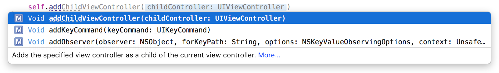

#Documentation  

No developer can remember the syntax and semantics of every one of the growing number of iOS APIs. That's where documentation comes in, and Xcode offers a number of ways to access context-sensitive and context-free documentation.

###Code-Completion Documentation
As this presentation talked about in a previous section, the code-completion feature offers symbol-completion suggestions to the developer as they are typing. An additional aspect of this feature is that for the selected symbol-completion list item, a short-description is offers to help disambiguate the options.

###Targeted Symbol Look-up
With the Utilities Panel visible and the *Quick Help Inspector* open, click on the symbol. Quick Help will populate with the documentation reference for that symbol.

An alternative to this if the developer chooses not to use the Utilities panel or the Quick Help Inspector, is to Option-Click on the symbol. A popup window will appear from the symbol with a more brief documentation description.

Whether from the Quick Help Inspector or the popup window, developers can access more detailed information about the symbol by clicking the Reference link towards the bottom of the documentation content.

*Reference*: [Mac Developer Library - Looking Up Documentation for an API Symbol](https://developer.apple.com/library/mac/recipes/xcode_help-source_editor/chapters/FindingAPIDocumentation.html)

###Documentation and API Reference Window
Access the full documentation and API reference without context-sensitive look-up by opening the "Window" menu and clicking on "Documentation and API Reference".

An alternative is to use the keyboard short-cut Shift-Command-0 (⇧⌘0).

