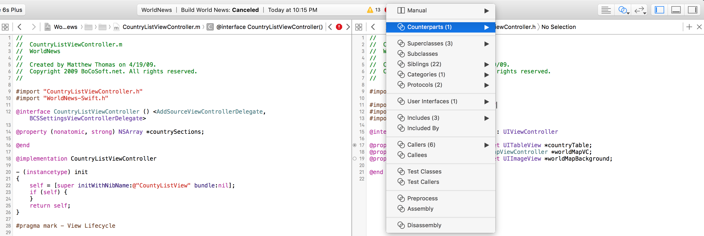
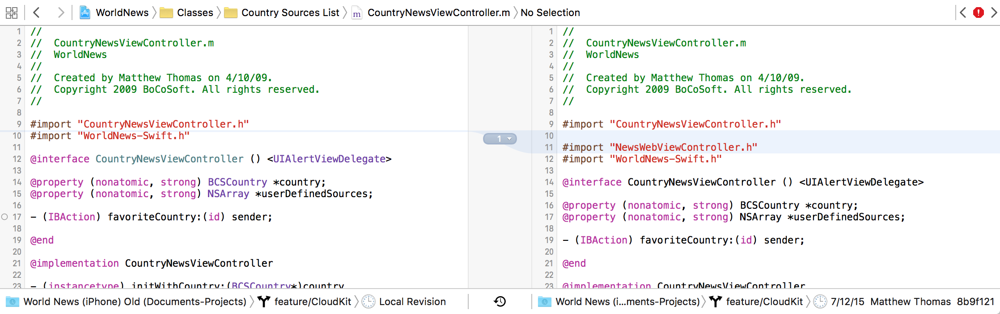
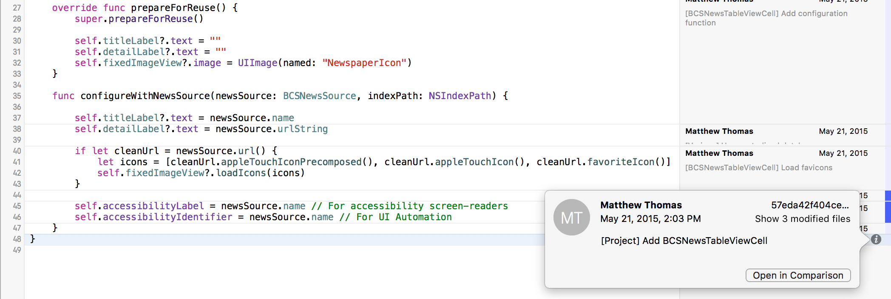
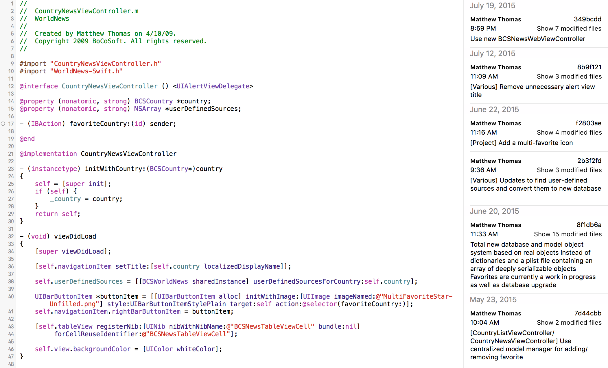

#Source Code Editors

The Editors segment control resides on the top right corner of the Xcode window, to the left of the panel segment control. This three-button segment allows developers to change between three different 'modes' of editing, which will be covered below. Additional options for each of the three buttons are available by clicking and *holding* on each button.  

###Standard Editor  
The standard editor is what many developers spend most of their time using. The Standard Editor consists of a single file opened at a time in the Source Editor area. The lack of additional views or contextual information makes this the fastest editor to work with.  

###Assistant Editor
When working with both the header and implementation files of a class, it is common to use the Assistant Editor to view both files at the same time, side-by-side. Another common use case is viewing an Interface Builder file along with the Nib owner source code simultaneously for quick and easy cross-referencing and outlet connections.  

Each view in the Assitant Editor owns its own portion of the Jump bar at the top of the Editor area. The root level menu on the Jump Bar offers manual selection of a file, as well as automatic suggestions to provide the developer with the most likely related files and counter-parts.  

  

The additional options accessible by clicking and holding on the Assistant Editor button enables the developer to present the editors using different layouts (i.e. horizontal vs vertical stacking).  

###Version Control Editor

The third and final editor relies on the integration of version control to be useful. Xcode supports the use of both Git and SVN, however Git has become the preferred source versioning system. Within the Version Control Editor, there are three modes to choose from:  

**Comparison**  
This is a great feature to compare the current version and pending changes to the source code with the previous checkin. Comparison can also be used to change different versions of the previous source code against each other; this might be helpful for when a developer is searching for the point in time at which a bug was introduced.  

  

**Blame**  
Though the name sounds unfriendly, Blame mode is a powerful tool to follow the history of source code and if need be, track down the original author of the file or a specific set of lines. This may be important in cases where the business decisions surrounding the implementation of a piece of source code are not well documented, and the developer needs to talk with whoever wrote the first version of the code in order to discuss with them about it.  

  

**Log**  
The "Log" mode enables a developer to see all changes affecting the entire file over time. This feature also helps with tracking down the original authors and seeing how the source code has evolved over time.  

  

**Previous**: [Source Editor](source-editor.md)  
**Next Up**: [Documentation](documentation.md)  
...or return to the [homepage](README.md).
