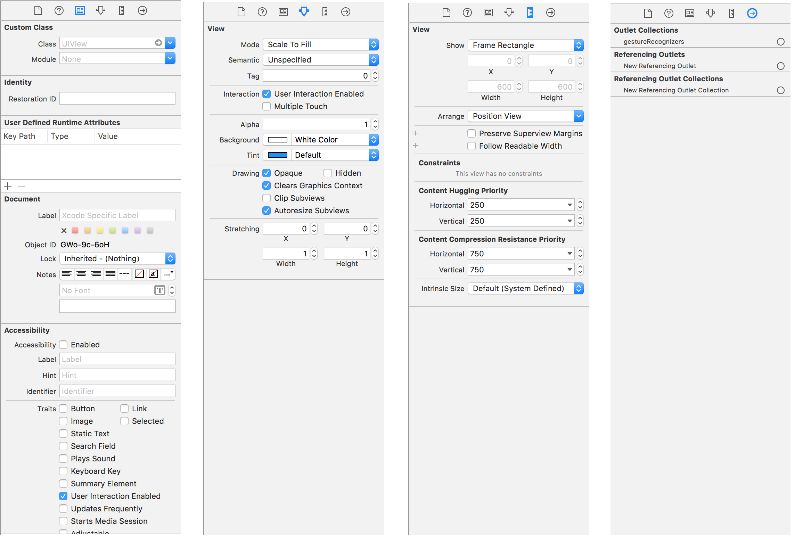

#Interface Builder  

Interface Builder (IB) provides developers a way to build out the user-interface without writing any code. Developers can accomplish everything in code, however Interface Builder provides quick and visual shortcuts for UI design.

###Assistant
It is often helpful for developers to simultaneously cross-reference a view with its code-behind. To this end, the Assistant editor, activated from within Interface Builder, displays both the view design as well as the code that controls it. Most commonly, a developer would be modifying the view controller and the view Nib that the view controller is responsible for.

###Storyboards
Introduced in iOS 5, Storyboards allow developers to design entire workflows.

###Autolayout
One of the power features delivered in iOS 6 is Autolayout; a relation-based dynamic runtime positioning system for views. Prior to iOS 6, developers used Springs and Struts however this was limited in its capabilities and often required developers to write code to manually position even moderately complex view layouts.

Autolayout is fairly complex to a first-time user, but there are many tutorials available that can help walk through the concepts. Ray Wenderlich offers a [14-part video series](http://www.raywenderlich.com/video-tutorials#autolayout) on Autolayout.

###Size Classes
As a way of handling the growing divergence in screen sizes, Apple introduced Size Classes in iOS 8. Constraints can be enabled or disabled on a per-size-class basis to achieve specialized layouts for certain screen sizes without having to create multiple versions of the same storyboard or Nib for each screen size.

Screen Dimensions are broken down into "Compact" and "Regular" along both Horizontal and Vertical axes. If constraints should be enabled in both "Compact" and "Regular" Size Classes, then "Any" can be used.

###Utilities
When using Interface Builder, the Utilities panel on the right-hand side displays specialized Inspector tabs for manipulating IB content. Besides the normal "File" and "Quick Help" Inspector, below are the 4 tabs that become visible in IB and a short description of each one.

#####Identity Inspector
Common workflows include setting a custom subclass for a subview, or setting the accessibility attributes of a view.

#####Attributes Inspector
Use this inspector to set the specialized attributes of a view. Each view subclass has its own set of custom attributes. For example, buttons allow developers to set the title, text color, image, and state configurations. This inspector is important for customizing the look and feel of each view element.

#####Size Inspector
Use this inspector for modifying the layout attributes of each view element. If the Nib is using autolayout, the frame values will reflect the current view location, however setting the frame components will have no affect on the runtime positioning of the view because autolayout manages the size and position using the view constraints.

In addition to constraints, the content hugging and compression resistance priorities can be modified on this inspector. This priorities are important to pay attention to when multiple views need to share space along each axis. When the superview shrinks, higher compression resistance priority should be given to views whose content is more important. When a superview expands, the hugging priority of a subview can be raises so that it does not expand beyond the needs of its content.

If the Nib is not using autolayout, then this tab is where the developer could modify the springs and struts of a given view.

#####Connections Inspector
This inspector establishes the connections between the code and the interface builder. With buttons, for example, developers commonly drag the "Touch Up Inside" connection onto the code to create a new method that should be called when the button is tapped. If a subview needs to be manipulated in some way from the code (e.g. setting visibility, etc.), a referencing outlet can be created and linked to the code.
