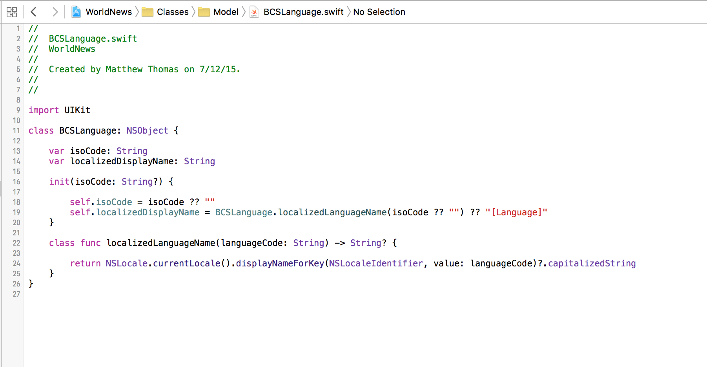
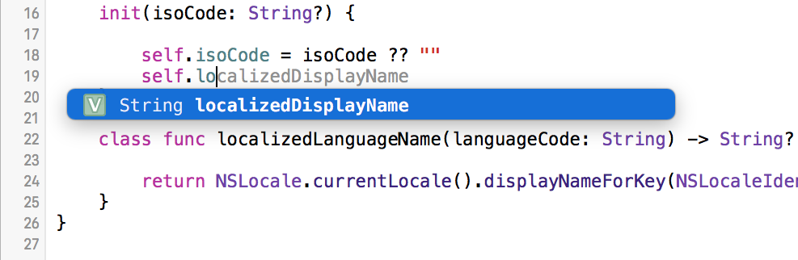
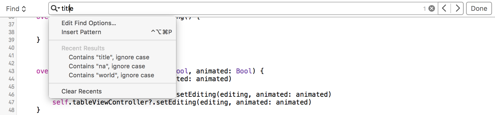
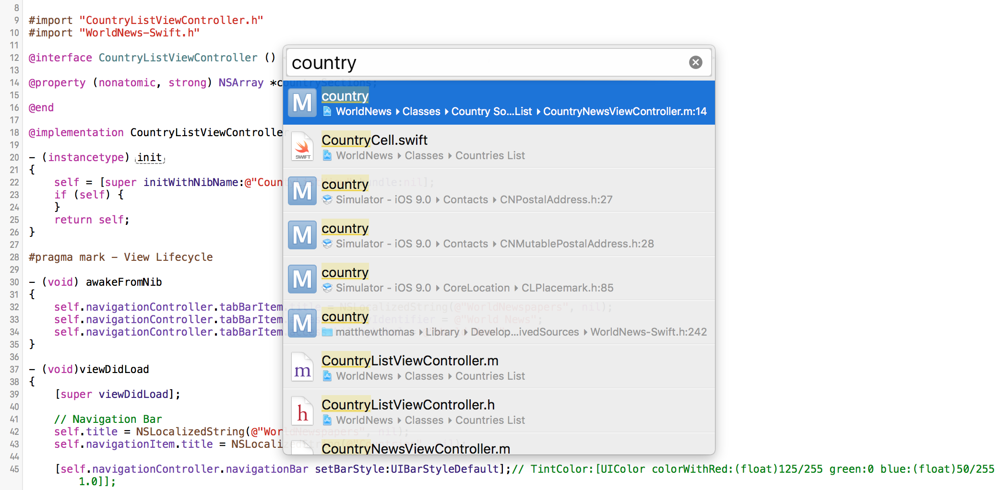
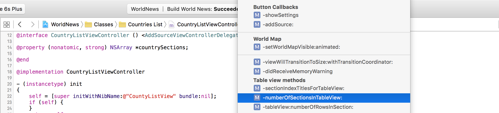
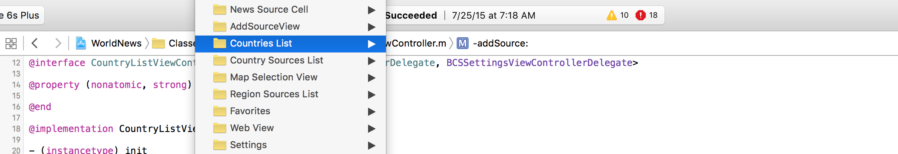

#Source Editor

The source editor is where developers spend most of their time. This window is used for writing code, setting break-points, browsing classes and resources.  

Xcode uses text color-coding in order to convey what words in the code represent (e.g. Class Names, Comments, Constants, Function Names, etc.).  

  

###Preferences
Source editor features (e.g. line numbers) can be customized in Xcode Preferences (⌘+Comma) under the "Text Editing" tab.  

  

###Code Completion
While typing in Xcode, it's easy to type the names of symbols (e.g. methods, variables, classes, etc.) using code completion. Code completion allows developers to type just a few characters before Xcode shows a list of likely code completion matches for what is being typed. The developer can then either use the computer mouse or the arrow keys to highlight the desired code completion option, and then hit enter or tab to select it.  

  

###File Searching  

To search for symbols within a file open in the source editor:  
* Under the Xcode Find menu, select "Find..."  
* Use the keyboard shortcut, Command+F (⌘F)  

  

The "Find" dropdown on the Find toolbar can be used to access the Find and Replace feature.  

The magnifying glass dropdown gives access to more advanced Find options like regular expressions, patterns, case matching and text wrapping.  

The left and right arrows on the far right of the toolbar navigate between found instances, and the done button completes and closes the Find-in-file toolbar.  

###File Navigation  

**Forward and Back Arrows**  
Xcode keeps a stack of the most recent files opened. Use the left and right arrows on the top left corner of the window to navigate the stack just like you would a web-browser. Alternatively, the keyboard shortcuts Control+Command+Left-Arrow (⌃⌘+Left) and Control+Command+Right-Arrow (⌃⌘+Right) may be used.  

**Header and Implementation**  
Quickly flip between the header and implementation files of class using the keyboard shortcut Command+Control+Up (⌘⌃+Up).

**Open Quickly**  
Quickly jump to a file without the Navigation pane by using the keyboard shortcut Command+Shift+O (⌘⇧+'O').  

  

**Jump Bar**  
At the top of the source editor area is the jump bar, which enables the developer to navigate to bookmarks (pragma marks, methods, etc.) in the current file...

  

...or jump to a different file in the project.  

  
